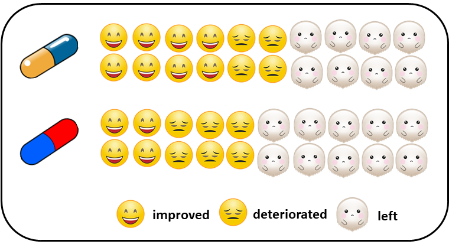

```{r setup, include=FALSE}
knitr::opts_chunk$set(echo = TRUE)
```

### Aim of the article and pre-requisites

By the end of this hands-on tutorial you should be familiar with:

* common mistakes in the analysis of missing participants in systematic
reviews with **aggregate data**;
* the pattern-mixture model and why it is the preferred method to deal with missing
participants when synthesising the trials; 
* conducting Bayesian network meta-analysis (NMA) with missing participants using 
the novel **R package** [**rnmamod**](https://cran.r-project.org/web/packages/rnmamod/index.html), and;
* the rich visualisation toolkit of the rnmamod that aims to assist you in critically
appraising the NMA results.

The minimum required knowledge to benefit from the article include:


## A familiar background in systematic reviews

You are leading a research project that involves conducting a systematic review
with multiple interventions for a specific health condition and patient population.
You and your team have spent a considerable amount of time and energy to set-up 
a protocol of high standards and ideally registered to PROSPERO. You have exhausted 
the (re)sources to search, retrieve and select the relevant trials that will represent 
your target population as close as possible. The data extraction is coming to an 
end, and you are looking forward to starting the analysis to uncover the best 
interventions for the investigated condition. Everybody is motivated, and overwhelmed, 
yet quite stressed to keep up with deadlines of the project. 

Some of the eligible trials report to have missing participants for each randomised 
intervention. How are you going to proceed with the analysis? Consider the following 
fictional (super) small trial in [Figure 1](#fig:fictional-example) for illustration: 
10 participants have been randomised to two interventions. The outcome is binary, 
such as the symptoms have improved or deteriorated after receiving the randomised 
intervention. We are interested in drawing conclusions using the whole randomised 
sample.

```{r fictional-example, echo=FALSE, out.width = "50%", out.height = "15%", fig.align="center", fig.cap = "Figure 1: A fictional small trial of two interventions", fig.alt=""}

```


The analysts wish to maintain the randomised sample, and they suggest assuming 
that the missing participants would have experienced the binary outcome, had 
they never left the trial, and move on with the analysis as usual. This coincides 
with adding the number of missing participants to the number of events reported 
for the participants who completed the study. For example, consider a study with 
100 participants randomised in an active intervention and placebo losses prematurely 
30% and 20% of the participants from the corresponding arms.


When you click the **Knit** button a document will be generated that includes both content as well as the output of any embedded R code chunks within the document. You can embed an R code chunk like this:

```{r cars}
summary(cars)
```

## Including Plots

You can also embed plots, for example:

```{r pressure, echo=FALSE}
plot(pressure)
```

Note that the `echo = FALSE` parameter was added to the code chunk to prevent printing of the R code that generated the plot.
