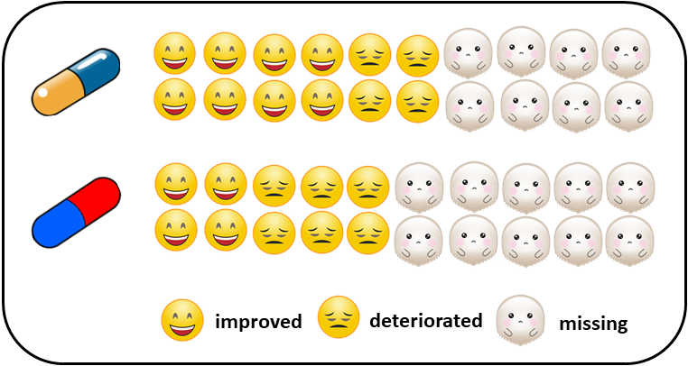
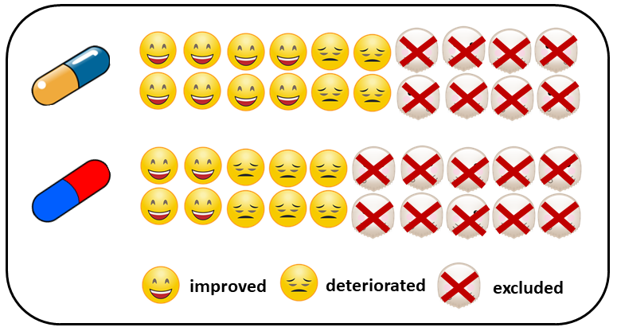
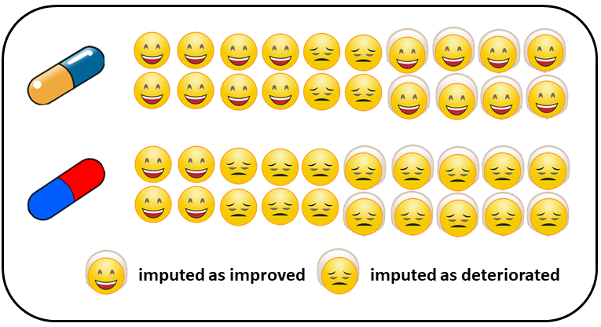

```{r setup, include=FALSE}
knitr::opts_chunk$set(echo = TRUE)
```

## Aim of the article and pre-requisites

By the end of this hands-on tutorial you should be familiar with:

* common misconceptions in the analysis of missing participants in systematic
reviews with **aggregate data**;
* the pattern-mixture model and why it is the preferred method to deal with missing
participants when synthesising the trials; 
* conducting Bayesian network meta-analysis with missing participants using 
the novel **R package** [**rnmamod**](https://cran.r-project.org/web/packages/rnmamod/index.html), and;
* the rich visualisation toolkit of the rnmamod that aims to assist you in critically
appraising your results.

The minimum required knowledge to benefit from the article includes being familiar
with:

* the assumptions, concept and the technical details of network meta-analysis;
* the Bayesian framework and related advances in evidence synthesis, and;
* the reporting requirements of network meta-analysis following the corresponding 
PRISMA extension statement [(Hutton et al., 2015)](https://pubmed.ncbi.nlm.nih.gov/26030634/). 

## A familiar background in systematic reviews

You are leading a research project that involves conducting a systematic review
with multiple interventions for a specific health condition and patient population.
You and your team have spent a considerable amount of time and energy to set-up 
a protocol of high standards and you have registered the protocol to [PROSPERO register](https://www.crd.york.ac.uk/prospero/). You have exhausted the (re)sources 
to search, retrieve and select the relevant trials that will represent your target 
population as close as possible. 

The data extraction is coming to an end, and you are looking forward to uncovering 
the best interventions for the investigated condition. Everybody is motivated, and 
overwhelmed, yet quite stressed to keep up with deadlines of the project. You pour 
some coffee in your favorite mug and you start the analysis. You notice that many 
eligible trials report to have missing participants for each randomised intervention. 
**How are you going to proceed with the analysis?** 

## The good, the bad, and the ugly 

Consider the following fictional (super) small trial in [Figure 1](#fig:fictional-example) 
for illustration: 10 participants have been randomised to two interventions. The 
outcome is binary, such as the symptoms have improved or deteriorated after receiving 
the randomised intervention. Some participants have completed the trial, and others 
left the trial prematurely for several reasons. We are interested in drawing conclusions 
using **the whole randomised sample**.

```{r fictional, echo=FALSE, out.width = "50%", out.height = "15%", fig.align="center", fig.cap = "Figure 1: A fictional small trial of two interventions", fig.alt=""}

```

Let's be honest; without access to individual patient data, there are only a few 
methods to address missing participants in meta-analysis:

1. **exclude** missing participants under the assumption that their outcome is 
missing for reasons unrelated to the planning and conduct of the trial 
(**missing completely at random, MCAR**) or their missing outcome is attributed 
to their baseline characteristics (**missing at random, MAR**),
2. **impute** missing participants under the assumption that they would have 
experienced improvement or deterioration of their symptoms, had they never left 
the trial (**missing not at random, MNAR**) and take this assumption for granted,
3. **model** the missingness mechanism (i.e., M(C)AR or MNAR) assuming a probability 
distribution that describes the association between the missing and observed 
participants concerning their outcomes (**pattern-mixture model**).

As you may have correctly guessed, exclusion and imputation are the bad and ugly 
methods, respectively, to handle missing participants. Exclusion is illustrated
in [Figure 2](#fig:excluded): missing participants in both interventions are removed 
from the dataset before conducting the analysis. This methods is inappropriate for 
the goals of our study, where we aim to draw conclusions for the whole randomised 
sample, as it reduces the sample to those participants who remained in the trial. 
Consequently, the power to detect a statistically significant association is 
also reduced. Moreover, if the missingness mechanism is not M(C)AR, the risk 
of estimating a biased intervention effect (e.g. odds ratio) is also imminent.

```{r excluded, echo=FALSE, out.width = "50%", out.height = "15%", fig.align="center", fig.cap = "Figure 2: Excluding missing participants from both interventions", fig.alt=""}

```

[Figure 3](#fig:imputed) illustrates the imputation: all missing participants in the 
first intervention have been assumed to have experienced improvement of their symptoms
(and thus, they left the trial prematurely), whilst all missing participants in 
the second intervention have been assumed to have experienced deterioration of their 
symptoms (and thus, they left the trial prematurely). Imputation implies adding 
the number of missing participants to the outcome dictated by the corresponding 
scenario: to the number of events (improvement) in the first intervention, and 
to the number of non-events (deterioration) in the second intervention. This method
maintains the randomised sample but takes the missingness scenario for granted. 
Without following the missing participants to record their outcome, we cannot 
know the true missingness mechanism. Hence, any assumptions we make about the missingness
mechanism should naturally propagate in the estimation of the intervention effect 
by increasing its standard error. Imputation rears its ugly head by 'treating' the 
missing participants as observed, increasing the risk to estimate a biased intervention 
effect and yield a spuriously narrow 95% confidence interval.

```{r imputed, echo=FALSE, out.width = "50%", out.height = "15%", fig.align="center", fig.cap = "Figure 3: Imputing missing participants making different scenarios in each intervention", fig.alt=""}

```

## Including Plots

You can also embed plots, for example:

```{r pressure, echo=FALSE}
plot(pressure)
```

Note that the `echo = FALSE` parameter was added to the code chunk to prevent printing of the R code that generated the plot.
