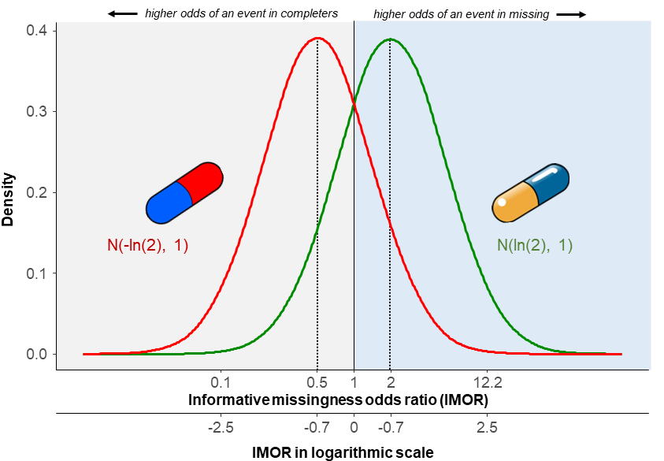
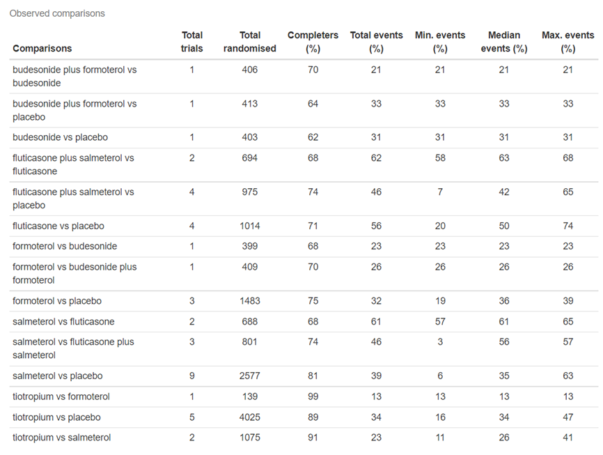
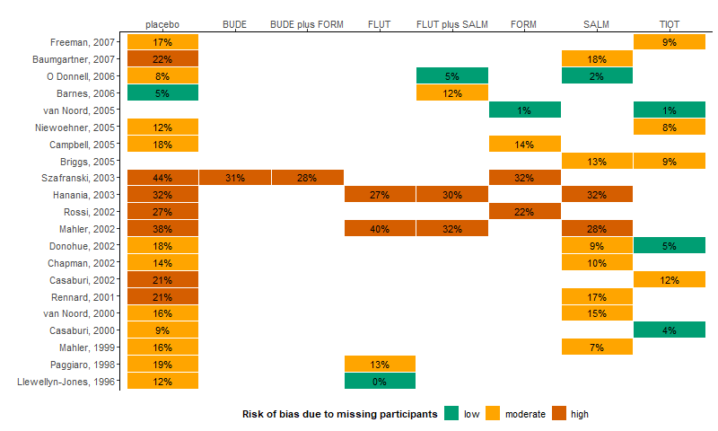
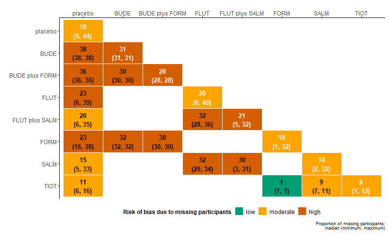
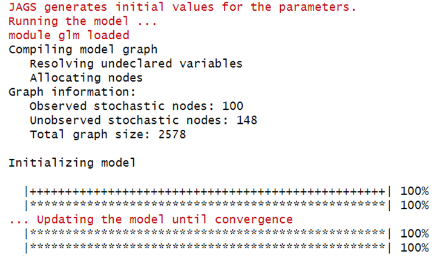
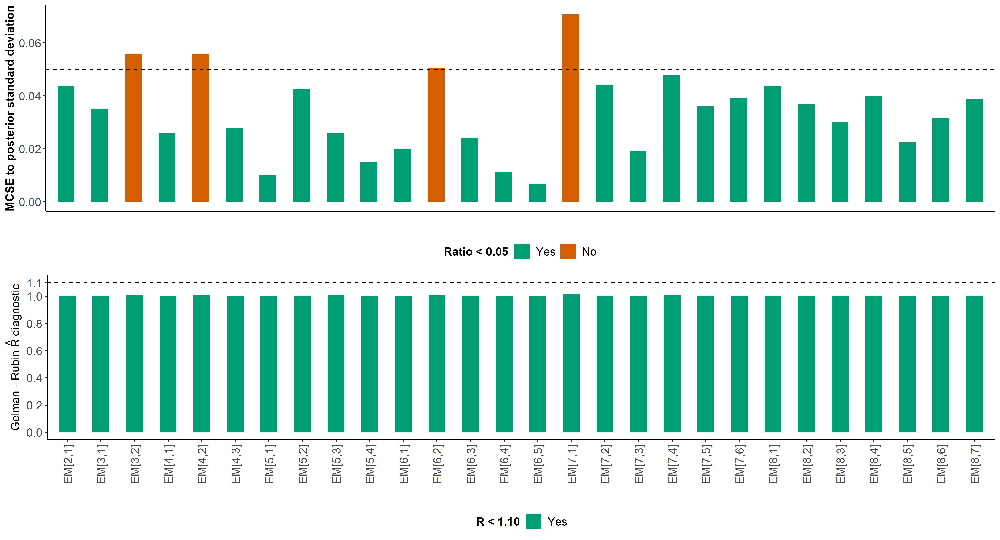
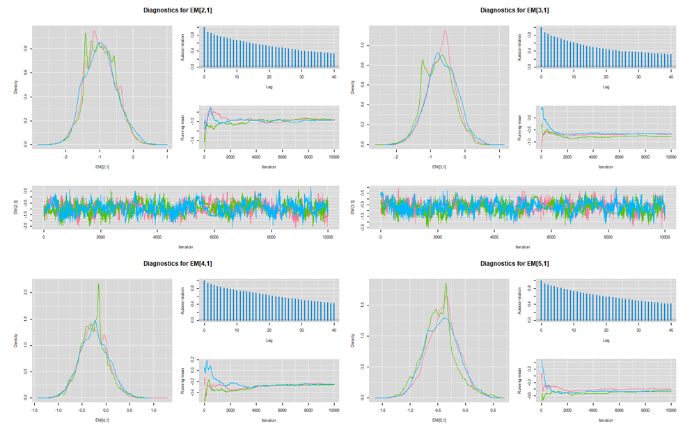
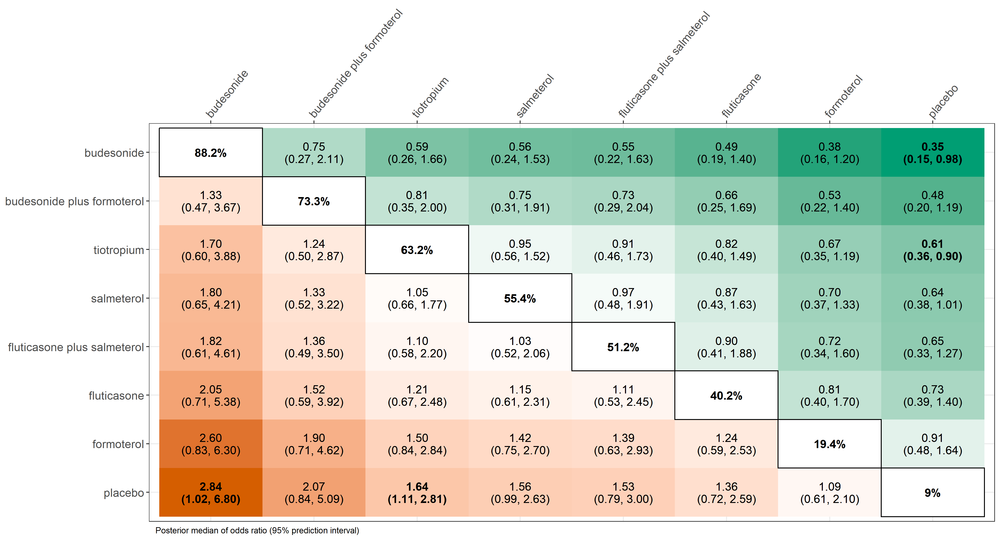

```{r setup, include=FALSE}
library(rnmamod)
knitr::opts_chunk$set(echo = TRUE)
```

```{r, echo=FALSE, out.width = "70%", out.height = "20%", fig.align="center", fig.cap = "", fig.alt=""}
knitr::include_graphics("./gigures/kangaroo-7459871_1280.JPG")
```

## Aim of the article and pre-requisites

By the end of this hands-on tutorial you should be familiar with:

* common misconceptions in the analysis of missing participants in systematic
reviews with **aggregate data**;
* the pattern-mixture model and why it is the preferred method to deal with missing
participants when synthesising the trials; 
* conducting Bayesian network meta-analysis with missing participants using 
the novel **R package** [**rnmamod**](https://cran.r-project.org/web/packages/rnmamod/index.html), and;
* the rich visualisation toolkit of the rnmamod that aims to assist you in critically
appraising your results.

The minimum required knowledge to benefit from the article includes being familiar
with:

* the assumptions, concept and the technical details of network meta-analysis;
* the Bayesian framework and related advances in evidence synthesis, and;
* the reporting requirements of network meta-analysis following the corresponding 
PRISMA extension statement [(Hutton et al., 2015)](https://pubmed.ncbi.nlm.nih.gov/26030634/). 

## A familiar background in systematic reviews

You are leading a research project that involves conducting a systematic review
with multiple interventions for a specific health condition and patient population.
You and your team have spent a considerable amount of time and energy to set-up 
a protocol of high standards and you have registered the protocol to [PROSPERO register](https://www.crd.york.ac.uk/prospero/). You have exhausted the (re)sources 
to search, retrieve and select the relevant trials that will represent your target 
population as close as possible. 

The data extraction is coming to an end, and you are looking forward to uncovering 
the best interventions for the investigated condition. Everybody is motivated, and 
overwhelmed, yet quite stressed to keep up with the deadlines of the project. You 
pour some coffee in your favorite mug and you start the analysis. You notice that 
many eligible trials report to have missing participants. 
**How are you going to proceed with the analysis?** 

## The good, the bad, and the ugly 

Consider the following fictional small trial in [Figure 1](#fig:fictional-example) 
for illustration: 20 participants have been randomised to two interventions. The 
outcome is binary, such as the symptoms have improved or deteriorated after receiving 
the randomised intervention. Some participants have completed the trial (called 
completers), and others left the trial prematurely for several reasons (called 
missing). We are interested in drawing conclusions using **the whole randomised sample**.

```{r fictional, echo=FALSE, out.width = "50%", out.height = "15%", fig.align="center", fig.cap = "Figure 1: A fictional small trial of two interventions", fig.alt=""}

```

Let's be honest; without access to individual patient data, there are only a few 
methods to address missing participants in meta-analysis:

1. **exclude** missing participants under the assumption that their outcome is 
missing for reasons unrelated to the planning and conduct of the trial 
(**missing completely at random, MCAR**) or their missing outcome is attributed 
to their baseline characteristics (**missing at random, MAR**),
2. **impute** missing participants under the assumption that they would have 
experienced improvement or deterioration of their symptoms, had they never left 
the trial (**missing not at random, MNAR**) and take this assumption for granted,
3. **model** the missingness mechanism (i.e., M(C)AR or MNAR) assuming a probability 
distribution that describes the association between the missing participants and  
the completers concerning their outcomes (**pattern-mixture model**).

### Exclusion

As you may have guessed, **exclusion** and **imputation** are suboptimal methods 
to handle missing participants. **Exclusion** is illustrated in 
[Figure 2](#fig:excluded): missing participants in both interventions 
are removed from the dataset before conducting the analysis. This methods is 
inappropriate for the goals of our study, where we aim to draw conclusions for the 
whole randomised sample, as it reduces the sample to those participants who remained 
in the trial. Consequently, the power to detect a statistically significant 
association is also reduced. Moreover, if the missingness mechanism is not M(C)AR, 
the risk of estimating a biased intervention effect (e.g. odds ratio) is imminent. 

```{r excluded, echo=FALSE, out.width = "50%", out.height = "15%", fig.align="center", fig.cap = "Figure 2: Excluding missing participants from both interventions", fig.alt=""}

```

### Imputation

[Figure 3](#fig:imputed) illustrates the **imputation**: all missing participants 
in the first intervention have been assumed to have experienced improvement of 
their symptoms (and thus, they left the trial prematurely), whilst all missing 
participants in the second intervention have been assumed to have experienced 
deterioration of their symptoms (and thus, they left the trial prematurely). 
Imputation implies adding the number of missing participants to the outcome 
dictated by the corresponding scenario: to the number of events (improvement) in 
the first intervention, and to the number of non-events (deterioration) in the 
second intervention. This method maintains the randomised sample but takes the 
missingness scenario for granted. Without following the missing participants to 
record their outcome, we cannot know the **true missingness mechanism**. Hence, 
any assumptions we make about the missingness mechanism should naturally propagate 
in the estimation of the intervention effect by increasing its standard error. 
Imputation rears its ugly head by 'treating' the missing participants as observed, 
increasing the risk to estimate a biased intervention effect and draw spurious 
conclusions regarding the statistical significance.

```{r imputed, echo=FALSE, out.width = "50%", out.height = "15%", fig.align="center", fig.cap = "Figure 3: Imputing missing participants making different scenarios in each intervention", fig.alt=""}
knitr::include_graphics("./gigures/imputed.png")
```

It is needless to say that meta-analysis inherits the limitations of exclusion 
and imputation observed at trial-level via the inclusion of studies with missing 
participants, giving you a real headache. Remember, you do not have individual 
patient data to make use of different cool methods for missing participants. Hence, 
the quality of the meta-analysis results will strongly dependent, among others, 
on your *good guess* about the missingness mechanism and how you incorporated 
this *good guess* into the results having access only to a handful of methods with 
some being suboptimal. We have good news on that; just, keep reading. 

### Pattern-mixture model

The last member of the squad of methods for missing participants in meta-analysis
is the pattern-mixture model. The **pattern-mixture model** circumvents the limitations 
of exclusion and imputation elegantly: it adjusts, rather than fixes, the average 
outcome (here, the risk of event) to the assumed missingness mechanism, and propagates 
this assumption to the standard error of the estimated intervention effect, while 
maintaining the randomised sample. It also allows the assumption about the missing
mechanism to differ between the interventions or across the trials. Therefore, the 
pattern-mixture model offers a flexible modelling framework to handle missing participants 
in meta-analysis properly. If exclusion, imputation and pattern-mixture model were 
characters from the epic Western spaghetti film, *The Good, the Bad and the Ugly*, 
the correspondence of who would be who is quite obvious.

[Figure 4](#fig:imor) illustrates two normal distributions of the 
**informative missingness odds ratio (IMOR)**, a central parameter in the 
pattern-mixture model for a binary outcome. IMOR resembles the odds ratio for
two interventions: it compares the odds of an event in missing participants with 
the odds of an event in completers. IMOR equal to 1 coincides with the MAR mechanism 
(i.e., no difference in the compared groups), and IMOR different from 1 implies 
the MNAR mechanism (i.e., the compared groups differ). 
As an illustration, we have considered a different IMOR distribution for each 
intervention: the first intervention is assumed to have *on average* twice the 
odds of an event in completers than that in missing participants (the mode), with 
other scenarios being less and less likely to occur as we deviate from the mode. 
On the contrary, the second intervention is assumed to have on average twice 
the odds of an event in missing participants than that in completers (the mode), 
again, with other scenarios being less and less likely to occur as we deviate 
from the mode. An important technical detail is that the normal distributions 
presented in [Figure 4](#fig:imor) are implied for the IMOR in the logarithmic 
scale, also commonly considered when estimating the odds ratio. 

```{r imor, echo=FALSE, out.width = "55%", out.height = "20%", fig.align="center", fig.cap = "Figure 4: The IMOR parameter under different scenarios for each intervention", fig.alt=""}

```

## The versatility of the rnmamod R package     

Originally, we developed the rnmamod R package as a response to facilitate handling 
aggregate missing participants in the absence of relevant functions in the available 
R packages for pairwise and network meta-analysis. Since then, one thing led to 
another and we ended up expanding our goals to set-up a comprehensive suite of 
functions to perform and visualise Bayesian pairwise and network meta-analysis. 
Proper handling of missing participants remains fundamental and is implemented 
using the pattern-mixture model in all models of the package. The rest of the 
tutorial walks you down to the core functions of the package to perform 
Bayesian **network meta-analysis** and obtain a compact, yet comprehensive visual 
summarisation of a large volume of results. 

### Let's get started

You may install and load the package directly **from CRAN** by running the code below:

```{r, warning=FALSE}
install.packages("rnmamod")
library(rnmamod)
```

However, we recommend installing the **development version** to experience the latest advances in the package:

```{r, results='hide', eval=FALSE}
install.packages("devtools")
devtools::install_github("LoukiaSpin/rnmamod")
```

We will use the dataset of [Baker et al. (2009)](https://pubmed.ncbi.nlm.nih.gov/19637942/) that includes 21 trials comparing seven pharmacological interventions with each other and placebo in chronic obstructive pulmonary disease (COPD) patients. We are interested in whether the patients experienced COPD exacerbation after receiving the randomised intervention. Run `head(nma.baker2009)` to see the first six trials, or `nma.baker2009` to glance at the whole dataset. The dataset has the one-trial-per-row format, which is the typical format encountered in models written in the BUGS language. 

```{r, results='hide'}
head(nma.baker2009)
#>                 study t1 t2 t3 t4 r1 r2 r3 r4 m1 m2 m3 m4  n1  n2 n3 n4
#> Llewellyn-Jones, 1996  1  4 NA NA  3  0 NA NA  1  0 NA NA   8   8 NA NA
#>        Paggiaro, 1998  1  4 NA NA 51 45 NA NA 27 19 NA NA 139 142 NA NA
#>          Mahler, 1999  1  7 NA NA 47 28 NA NA 23  9 NA NA 143 135 NA NA
#>        Casaburi, 2000  1  8 NA NA 41 45 NA NA 18 12 NA NA 191 279 NA NA
#>       van Noord, 2000  1  7 NA NA 18 11 NA NA  8  7 NA NA  50  47 NA NA
#>         Rennard, 2001  1  7 NA NA 41 38 NA NA 29 22 NA NA 135 132 NA NA
```

### Network plot and evidence description
 
Let's create the network plot using the `netplot` function (type `netplot` to learn more). If the plot looks familiar, it is because `netplot` currently calls the `nma.networkplot` function from the [pcnetmeta](https://CRAN.R-project.org/package=netmeta) R package:
  
```{r, results='hide', fig.show='hide'}
# The names of the interventions are in the order they appear in the dataset
interv_names <- c("placebo", "budesonide", "budesonide plus formoterol", "fluticasone", "fluticasone plus salmeterol", "formoterol", "salmeterol", "tiotropium")

# Create the network plot and tables
netplot(data = nma.baker2009, 
        drug_names = interv_names, 
        text.cex = 1.5)
```

```{r network_baker, echo=FALSE, out.width = "50%", out.height = "20%", fig.align="center", fig.cap = "", fig.alt=""}
knitr::include_graphics("./gigures/network_baker.jpg")
```

The `netplot` function gives further insights into the network evidence by prints on the console the followings three tables:

* **A description of the network evidence**

```{r network_evidence, echo=FALSE, out.width = "100%", out.height = "50%", fig.align="center", fig.cap = "", fig.alt=""}
knitr::include_graphics("./gigures/network_evidence.png")
```

* **A summary of the trials, randomised sample, and outcome data for each intervention**

```{r interventions_evidence, echo=FALSE, out.width = "100%", out.height = "50%", fig.align="center", fig.cap = "", fig.alt=""}
knitr::include_graphics("./gigures/interventions_evidence.png")
```

* **A summary of the trials, randomised sample, and outcome data for each observed comparison in the network**

```{r observed_comparisons, echo=FALSE, out.width = "100%", out.height = "50%", fig.align="center", fig.cap = "", fig.alt=""}

```

### Mapping the evidence on missing participants

The `nma.baker2009` dataset was selected for the substantial number of missing participants in most trials, interventions and comparisons. We use the `heatmap_missing_dataset` to have a look at how missing participants (in per cent) are distributed in the dataset. The presence of missing participants is quite intense; only a few trials have interventions with zero or low missingness. Type `?heatmap_missing_dataset` to find out more about this function.

```{r, results='hide', fig.show='hide'}
# Abbreviated interventions (in the order they appear in the datasets)
abbr_interv_names <- c("placebo", "BUDE", "BUDE plus FORM", "FLUT", "FLUT plus SALM", "FORM", "SALM", "TIOT")

# Create the heatmap of % missing participants for each trial and arm
heatmap_missing_dataset(data = nma.baker2009, 
                        trial_names = nma.baker2009$study,
                        drug_names = abbr_interv_names)
```

```{r missing_dataset, echo=FALSE, out.width = "100%", out.height = "50%", fig.align="center", fig.cap = "", fig.alt=""}

```

Use the `heatmap_missing_network` function to view the median and range of missing participants (in per cent) for each intervention (main diagonal) and comparison (lower off-diagonal). We can immediately spot the comparison with the lowest median of missing participants: tiotropium versus formoterol. Of note, we have used colours that are friendly to people with colour vision deficiency. Find out more about this function by typing `?heatmap_missing_network`.

```{r, results='hide', fig.show='hide'}
# Abbreviated interventions (in the order they appear in the dataset)
abbr_interv_names <- c("placebo", "BUDE", "BUDE plus FORM", "FLUT", "FLUT plus SALM", "FORM", "SALM", "TIOT")

# Create the heatmap of % missing participants for each intervention and observed comparison
heatmap_missing_network(data = nma.baker2009, 
                        drug_names = abbr_interv_names)
```

```{r missing_network, echo=FALSE, out.width = "100%", out.height = "50%", fig.align="center", fig.cap = "", fig.alt=""}

```

### The fine architecture of the rnmamod package

Now you will be introduced to the *backbone function* of the rnmamod architecture: the `run_model`. In short, this is the function to conduct **Bayesian network meta-analysis** while accounting for the missing participants (if extracted) via the pattern-mixture model. As you will discover in the next chapters of the tutorial, most functions in the package cannot work without the `run_model` function. At the same time, the `run_model` function is not much of use as a *stand-alone* function: it merely returns the results for a bulk of model parameters (and they are a lot). The magic begins once the `run_model` function is fed into the remaining functions of the package. Then you get to run all necessary analyses that accompany network meta-analysis and obtain a plethora of graphs to help you understand the results and outline your conclusions, **while wearing your critical hat**. 

### Conduct a random-effects network meta-analysis

Without further ado, let's run a Bayesian random-effects (`model = "RE"`) network meta-analysis while, at the same time, addressing the missing participants reported in each intervention arm of every trial. The effect measure of interest is the odds ratio (`measure = "OR"`). We consider a half-normal prior distribution on the between-trial standard deviation with scale parameter equal to 1 (`heter_prior = list("halfnormal", 0, 1)`). We will estimate one IMOR parameter for each intervention in the network (`assumption = "IDE-ARM"`) under the *MAR* assumption on average (`mean_misspar = c(0, 0)`) with a variance equal to 1 (`var_misspar = 1`). The investigated outcome is harmful (`D = 0`). Make sure to assign a name to the function to be used as an object in other functions of the model. Note that `run_model` and all other model functions of the package run in [JAGS](https://mcmc-jags.sourceforge.io/).
  
```{r, results='hide', message=FALSE, eval=FALSE}
res <- run_model(data = nma.baker2009,
                 measure = "OR",
                 model = "RE",
                 assumption = "IDE-ARM",
                 heter_prior = list("halfnormal", 0, 1),
                 mean_misspar = c(0, 0), 
                 var_misspar = 1,
                 D = 0,
                 n_chains = 3,
                 n_iter = 10000,
                 n_burnin = 1000,
                 n_thin = 1)
```

On the console you see will two sets of progress bars: the first one shows the progress of the simulation. Once the model completes the iterations for all chains, a second progress bar appears on the console that shows the progress of the model update for `n_iter = 10000` iterations until convergence:

```{r run_model, echo=FALSE, out.width = "60%", out.height = "30%", fig.align="left", fig.cap = "", fig.alt=""}

```

> Specifying carefully the arguments of the `run_model` function is essential for the subsequent analyses to yield sensible results. This requires thorough consideration of the proper effect measure (`measure`), the meta-analysis model (`model`), the structure of the missingness parameter (`assumption`), the prior distribution for the heterogeneity parameter (`heter_prior`), the missingness mechanism (`mean_misspar` and `var_misspar`), the direction of the outcome (`D`), and the necessary tuning parameters to run Markov chain Monte Carlo simulations using JAGS (`n_chains`, `n_iter`, `n_burning`, and `n_thin`). Refer to the documentation of the function by typing `?run_model`.

Now we can use `res` in the arguments of the other model functions to conduct the subsequent analyses, and visualise the results. The *journey* has just begun.

### Markov chain Monte Carlo diagnostics

We will use the homonym function, `mcmc_diagnostic`, to find out how our model fared in terms of convergence. 

```{r, results='hide', message=FALSE, eval=FALSE}
mcmc_diagnostics(net = res,
                 par = c("EM", "tau"))

```

The function prints on the console a message on *good diagnostic practices* (in red), followed by the names of panel plots and tables on several monitored parameters. 

```{r mcmc_diagn_console, echo=FALSE, out.width = "100%", out.height = "70%", fig.align="left", fig.cap = "", fig.alt=""}
knitr::include_graphics("./gigures/mcmc_diagn_console.png")
```

Here, we illustrate a panel of bar plots on the log odds ratio for all possible comparisons in the network (x-axis):

```{r mcmc_effect, echo=FALSE, out.width = "75%", out.height = "50%", fig.align="center", fig.cap = "", fig.alt=""}

```

Then `mcmc_diagnostics` opens a browser with a panel of diagnostic plots (trace, density, and autocorrelation) for the monitored parameters specified in the `par` argument (here, the log odds ratio for all possible pairwise comparisons, `"EM"`, and the common between-trial standard deviation, `"tau"`). The HTML file is created thanks to the `mcmcplot` function of the R-package [mcmcplots](https://CRAN.R-project.org/package=mcmcplots).

```{r mcmc_browser, echo=FALSE, out.width = "100%", out.height = "70%", fig.align="left", fig.cap = "", fig.alt=""}

```

### The league tables

#### Estimation

Use the `league_heatmap` function to create the popular league table by running the following code:

```{r, fig.show='hide', eval=FALSE}
# The names of the interventions are in the order they appear in the dataset
interv_names <- c("placebo", "budesonide", "budesonide plus formoterol", "fluticasone", "fluticasone plus salmeterol", "formoterol", "salmeterol", "tiotropium")

# The league table as a heatmap
league_heatmap(full1 = res, 
               drug_names1 = interv_names)
```

```{r league_baker, echo=FALSE, out.width = "100%", out.height = "70%", fig.align="left", fig.cap = "", fig.alt=""}
knitr::include_graphics("./gigures/league_baker.png")
```

The table is read as row versus column. For instance, budesonide plus formoterol (row) versus budesidone (column) is associated with the (posterior mean) odds ratio of 1.28 and a 95% credible interval (0.47, 3.60). The interventions are sorted in decreasing order by their posterior mean [SUCRA](https://pubmed.ncbi.nlm.nih.gov/20688472/) value shown in the main diagonal. The larger the treatment effect, the darker the colour shade. The outcome is harmful, hence, blue favours the first intervention of the comparison, and red favours the second intervention. The `league_heatmap` function can also display the treatment effects from two outcomes. For more details, type `?league_heatmap`.

#### Prediction

The `league_heatmap_pred` function has the **same arguments** with the `league_heatmap` function, but it displays the predictions for all possible pairwise comparisons in the network:

```{r, fig.show='hide', eval=FALSE}
# The names of the interventions are in the order they appear in the dataset
interv_names <- c("placebo", "budesonide", "budesonide plus formoterol", "fluticasone", "fluticasone plus salmeterol", "formoterol", "salmeterol", "tiotropium")

# The league table as a heatmap
league_heatmap_pred(full1 = res, 
                    drug_names1 = interv_names)
```

```{r league_baker_pred, echo=FALSE, out.width = "100%", out.height = "70%", fig.align="left", fig.cap = "", fig.alt=""}

```
