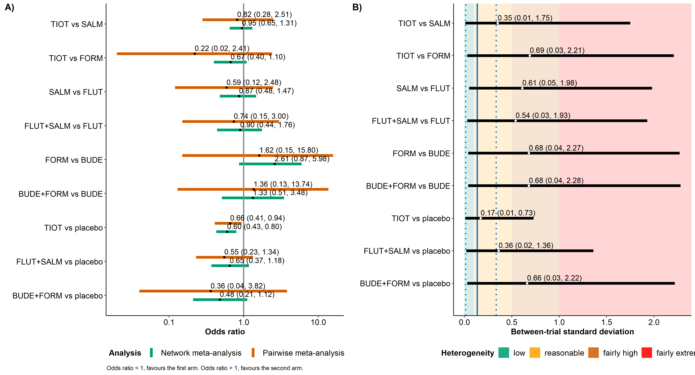
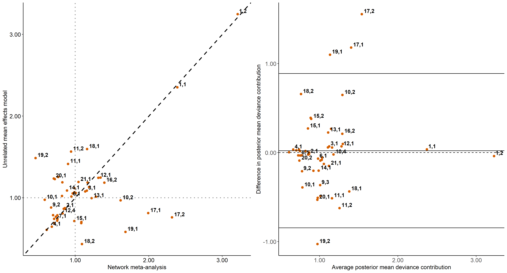
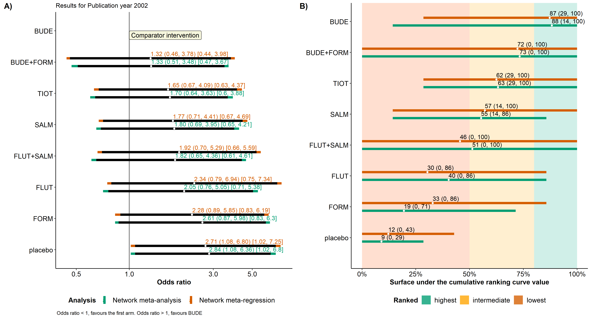

```{r setup, include=FALSE}
library(rnmamod)
knitr::opts_chunk$set(echo = TRUE)
```

```{r, echo=FALSE, out.width = "70%", out.height = "20%", fig.align="center", fig.cap = "", fig.alt=""}
knitr::include_graphics("./gigures/kangaroo-7459871_1280.JPG")
```

## Aim of the article and pre-requisites

By the end of this hands-on tutorial you should be familiar with:

* common misconceptions in the analysis of missing participants in systematic
reviews with **aggregate data**;
* the pattern-mixture model and its advantages in dealing with missing participants when synthesizing trials; 
* conducting Bayesian network meta-analysis with missing participants using the **R package** [**rnmamod**](https://cran.r-project.org/web/packages/rnmamod/index.html), and;
* the rnmamod package's rich visualization toolkit for critically appraising results

The minimum knowledge to benefit from the tutorial includes being familiar
with:

* the basics of network meta-analysis, including its assumptions, concept and technical details;
* the Bayesian framework and recent advancements in evidence synthesis, and;
* the reporting requirements of network meta-analysis following the corresponding 
PRISMA extension statement [(Hutton et al., 2015)](https://pubmed.ncbi.nlm.nih.gov/26030634/). 

## Familiarity with systematic reviews

You are leading a research project involving a systematic review
of multiple interventions for a specific health condition and patient population.
You have put in a lot of effort to establish a high-standards  protocol, registered it with [PROSPERO register](https://www.crd.york.ac.uk/prospero/) and 
completed the data extraction.

While reviewing the extracted data, you notice that many eligible trials report having missing participants. 
**How are you going to proceed with the analysis?** 

## The good, the bad, and the ugly 

Consider the small fictional trial in [Figure 1](#fig:fictional-example), where 20 participants have been randomised into two interventions and
the outcome is binary (symptoms improved or worsened after intervetion). Some participants completed the trial (completers), while others left the trial prematurely for several reasons (missing). The goal is to draw conclusions using **the entire randomised sample**.

```{r fictional, echo=FALSE, out.width = "50%", out.height = "15%", fig.align="center", fig.cap = "Figure 1: A fictional small trial of two interventions", fig.alt=""}
knitr::include_graphics("./gigures/fictional.png")
```

Without individual participant data, there are only a few 
methods to handle missing participants in (network) meta-analysis:

1. **Exclusion** – under the assumption that the missing participants' outcomes are
missing due to reasons unrelated to the planning and conduct of the trial 
(**missing completely at random, MCAR**), or due to their baseline characteristics (**missing at random, MAR**),
2. **Imputation** – assuming that the missing participants would have improved or worsened symptoms had they not left 
the trial (**missing not at random, MNAR**),
3. **Modelling** – the missingness mechanism (i.e., M(C)AR or MNAR) using a probability 
distribution to describe the association between the missing and completers' outcomes (**pattern-mixture model**).

### Exclusion

Both **exclusion** and **imputation** are suboptimal methods 
in handling missing participants. **Exclusion**, as shown in 
[Figure 2](#fig:excluded), is not appropriate as it reduced the sample to those participants who remained
in the trial and decreases the power to detect significant associations. Moreover, if the missingness mechanism is not M(C)AR, 
the risk of estimating a biased intervention effect (e.g., odds ratio) is imminent. 

```{r excluded, echo=FALSE, out.width = "50%", out.height = "15%", fig.align="center", fig.cap = "Figure 2: Excluding missing participants from both interventions", fig.alt=""}
knitr::include_graphics("./gigures/excluded.png")
```

### Imputation

[Figure 3](#fig:imputed) illustrates the **imputation** of missing participants in two interventions.
In in the first intervention, it is assumed that all missing participants experienced symptom improvement 
and thus, left the trial prematurely. In the second intervention, it is assumed that all missing 
participants experienced symptom deterioration and left the trial prematurely. 
Imputation implies adding the number of missing participants to the outcome 
based on the corresponding scenario: to the number of events (improvement) in 
the first intervention and to the number of non-events (deterioration) in the 
second intervention. This method preserves the randomised sample but assumes the 
missingness scenario. Without following the missing participants to 
record their outcome, we cannot know the **true missingness mechanism**. Hence, 
any assumptions we make about the missingness mechanism should naturally propagate 
in the estimation of the intervention effect by increasing its standard error. 
Imputation rears its ugly head by 'treating' the missing participants as observed, 
increasing the risk to estimate a biased intervention effect and draw erroneous
statistical significance conclusions.

```{r imputed, echo=FALSE, out.width = "50%", out.height = "15%", fig.align="center", fig.cap = "Figure 3: Imputing missing participants making different scenarios in each intervention", fig.alt=""}
knitr::include_graphics("./gigures/imputed.png")
```
(Network) meta-analysis inherits the limitations of exclusion 
and imputation observed at trial-level via the inclusion of trials with missing 
participants. As you do not have individual 
participant data to make use of different cool methods for missing participants, 
the quality of the (network) meta-analysis results will strongly depend, among others things, 
on your *good guess* about the missingness mechanism and how you incorporate 
this *good guess* into the results. We have good news on that; just, keep reading. 

### Pattern-mixture model

The last member of the squad of methods for missing participants in (network) meta-analysis
is the pattern-mixture model. The **pattern-mixture model** elegantly adjusts, rather than fixes, the average 
outcome (in this case, the risk of event) to the assumed missingness mechanism, and propagates 
this assumption to the standard error of the estimated intervention effect, while 
maintaining the randomised sample. It allows for different assumptions about the missing
mechanism  between interventions or across the trials, offering a flexible framework for properly handling missing participants 
in (network) meta-analysis. If exclusion, imputation and pattern-mixture model were 
characters from the epic Western spaghetti film, *The Good, the Bad and the Ugly*, 
the correspondence of who would be who is rather clear.

[Figure 4](#fig:imor) shows two normal distributions of the 
**informative missingness odds ratio (IMOR)**, which is a central parameter in the 
pattern-mixture model for a binary outcome. IMOR is similar to the odds ratio for
two interventions, as it compares the odds of an event in missing participants with 
the odds of an event in completers. An IMOR equal to 1 indicates the MAR mechanism 
(i.e., no difference in the compared groups), and an IMOR different from 1 implies 
the MNAR mechanism (i.e., the compared groups differ). 
To illustrate this, we have considered a different IMOR distribution for each 
intervention. For the the first intervention, we assumed that, *on average*, the odds of an event  
in completers were twice that in missing participants (the mode), with 
other scenarios being less likely to occur as we deviate from the mode. 
For the second intervention, we assumed that, on average, 
the odds of an event in missing participants were twice that in completers (the mode), 
again, with other scenarios being less likely to occur as we deviate 
from the mode. It is important to note that the normal distributions 
presented in [Figure 4](#fig:imor) are implied for the IMOR in the logarithmic 
scale, which is commonly used when estimating the odds ratio. 

```{r imor, echo=FALSE, out.width = "55%", out.height = "20%", fig.align="center", fig.cap = "Figure 4: The IMOR parameter under different scenarios for each intervention", fig.alt=""}
knitr::include_graphics("./gigures/imor.png")
```

## The versatility of the rnmamod R package     

The rnmamod R package was originally developed to address the lack of dedicated functions for handling
missing participants in pairwise and network meta-analysis in existing R packages. Over time, our goal expanded to create a comprehensive 
suite of functions to perform and visualise Bayesian pairwise and network meta-analysis. 
Proper handling of missing participants remains fundamental and is implemented 
using the pattern-mixture model in all models of the package. The rest of the 
tutorial walks you down to the core functions of the package to perform 
Bayesian **network meta-analysis** and obtain a compact, yet comprehensive visual 
summarisation of a large volume of results. 

### Let's get started

You may install and load the package directly **from CRAN** by running the code below:

```{r, warning=FALSE}
install.packages("rnmamod")
library(rnmamod)
```

However, we recommend installing the **development version** to experience the latest advances in the package:

```{r, results='hide', eval=FALSE}
install.packages("devtools")
devtools::install_github("LoukiaSpin/rnmamod")
```

We will use the dataset of [Baker et al. (2009)](https://pubmed.ncbi.nlm.nih.gov/19637942/) that includes 21 trials comparing seven pharmacological interventions with each other and placebo in chronic obstructive pulmonary disease (COPD) patients. We are interested in whether the patients experienced COPD exacerbation after receiving the randomised intervention. Run `head(nma.baker2009)` to see the first six trials, or `nma.baker2009` to glance at the whole dataset. The dataset has the one-trial-per-row format, which is the typical format encountered in models written in the BUGS language. 

```{r, results='hide'}
head(nma.baker2009)
#>                 study t1 t2 t3 t4 r1 r2 r3 r4 m1 m2 m3 m4  n1  n2 n3 n4
#> Llewellyn-Jones, 1996  1  4 NA NA  3  0 NA NA  1  0 NA NA   8   8 NA NA
#>        Paggiaro, 1998  1  4 NA NA 51 45 NA NA 27 19 NA NA 139 142 NA NA
#>          Mahler, 1999  1  7 NA NA 47 28 NA NA 23  9 NA NA 143 135 NA NA
#>        Casaburi, 2000  1  8 NA NA 41 45 NA NA 18 12 NA NA 191 279 NA NA
#>       van Noord, 2000  1  7 NA NA 18 11 NA NA  8  7 NA NA  50  47 NA NA
#>         Rennard, 2001  1  7 NA NA 41 38 NA NA 29 22 NA NA 135 132 NA NA
```

### Network plot and evidence description
 
Let's create the network plot using the `netplot` function (type `?netplot` to learn more):
  
```{r, results='hide', fig.show='hide'}
# The names of the interventions are in the order they appear in the dataset
interv_names <- c("placebo", "budesonide", "budesonide plus formoterol", "fluticasone", "fluticasone plus salmeterol", "formoterol", "salmeterol", "tiotropium")

# Create the network plot and tables
netplot(data = nma.baker2009, 
        drug_names = interv_names, 
        text.cex = 1.5)
```

```{r network_baker, echo=FALSE, out.width = "50%", out.height = "20%", fig.align="center", fig.cap = "", fig.alt=""}

```

If the plot looks familiar, it is because `netplot` currently calls the `nma.networkplot` function from the [pcnetmeta](https://CRAN.R-project.org/package=netmeta) R package.

The `netplot` function gives further insights into the network evidence by printing the following three tables on the console:

* **A description of the network evidence**

```{r network_evidence, echo=FALSE, out.width = "100%", out.height = "50%", fig.align="center", fig.cap = "", fig.alt=""}

```

* **A summary of the trials, randomised sample, and outcome data for each intervention**

```{r interventions_evidence, echo=FALSE, out.width = "100%", out.height = "50%", fig.align="center", fig.cap = "", fig.alt=""}

```

* **A summary of the trials, randomised sample, and outcome data for each observed comparison in the network**

```{r observed_comparisons, echo=FALSE, out.width = "100%", out.height = "50%", fig.align="center", fig.cap = "", fig.alt=""}
knitr::include_graphics("./gigures/observed_comparisons.png")
```

### Mapping the evidence on missing participants

The `nma.baker2009` dataset was selected for the substantial number of missing participants in most trials, interventions and comparisons. We use the `heatmap_missing_dataset` function to have a look at how missing participants (in per cent) are distributed in the dataset:

```{r, results='hide', fig.show='hide'}
# Abbreviated interventions (in the order they appear in the datasets)
abbr_interv_names <- c("placebo", "BUDE", "BUDE plus FORM", "FLUT", "FLUT plus SALM", "FORM", "SALM", "TIOT")

# Create the heatmap of % missing participants for each trial and arm
heatmap_missing_dataset(data = nma.baker2009, 
                        trial_names = nma.baker2009$study,
                        drug_names = abbr_interv_names)
```

```{r missing_dataset, echo=FALSE, out.width = "100%", out.height = "50%", fig.align="center", fig.cap = "", fig.alt=""}
knitr::include_graphics("./gigures/missing_dataset.png")
```

The presence of missing participants is quite intense; only a few trials have interventions with zero or low missingness. 

Use the `heatmap_missing_network` function to view the median and range of missing participants (in per cent) for each intervention (main diagonal) and comparison (lower off-diagonal):

```{r, results='hide', fig.show='hide'}
# Abbreviated interventions (in the order they appear in the dataset)
abbr_interv_names <- c("placebo", "BUDE", "BUDE plus FORM", "FLUT", "FLUT plus SALM", "FORM", "SALM", "TIOT")

# Create the heatmap of % missing participants for each intervention and observed comparison
heatmap_missing_network(data = nma.baker2009, 
                        drug_names = abbr_interv_names)
```

```{r missing_network, echo=FALSE, out.width = "100%", out.height = "50%", fig.align="center", fig.cap = "", fig.alt=""}
knitr::include_graphics("./gigures/missing_network.png")
```

We can immediately spot the comparison with the lowest median of missing participants: tiotropium versus formoterol. Of note, we have used colours that are friendly to people with colour vision deficiency.

### The fine architecture of the rnmamod package

Now you will be introduced to the *backbone function* of the rnmamod architecture: the `run_model`. In short, this is the function to conduct **Bayesian network meta-analysis** while accounting for the missing participants (if extracted) via the pattern-mixture model. As you will discover in the next chapters of the tutorial, most functions in the package cannot work without the `run_model` function. At the same time, the `run_model` function is not much of use as a *stand-alone* function: it merely returns the results for a bulk of model parameters (and they are a lot). The magic begins once the `run_model` function is fed into the remaining functions of the package. Then you get to run all necessary analyses that accompany network meta-analysis and obtain a plethora of graphs to help you understand the results and outline your conclusions, **while wearing your thinking hat**. 

### Conduct a random-effects network meta-analysis

Without further ado, let's run a Bayesian random-effects (`model = "RE"`) network meta-analysis while, at the same time, addressing the missing participants reported in each intervention arm of every trial. The effect measure of interest is the odds ratio (`measure = "OR"`). We consider a half-normal prior distribution on the between-trial standard deviation with scale parameter equal to 1 (`heter_prior = list("halfnormal", 0, 1)`). We will estimate one IMOR parameter for each intervention (`assumption = "IDE-ARM"`) under the *MAR* assumption on average (`mean_misspar = c(0, 0)`) with a variance equal to 1 (`var_misspar = 1`). The investigated outcome is harmful (`D = 0`). Make sure to assign a name to the function to be used as an object in the other functions of the model. Note that `run_model` and all other model functions of the package run in [JAGS](https://mcmc-jags.sourceforge.io/).
  
```{r, results='hide', message=FALSE, eval=FALSE}
## Run random-effects network meta-analysis
res <- run_model(data = nma.baker2009,
                 measure = "OR",
                 model = "RE",
                 assumption = "IDE-ARM",
                 heter_prior = list("halfnormal", 0, 1),
                 mean_misspar = c(0, 0), 
                 var_misspar = 1,
                 D = 0,
                 n_chains = 3,
                 n_iter = 10000,
                 n_burnin = 1000,
                 n_thin = 1)
```

On the console you see will two sets of progress bars: the first one shows the progress of the simulation. Once the model completes the iterations for all chains, a second progress bar appears on the console that shows the progress of the model update for `n_iter = 10000` iterations until convergence:

```{r run_model, echo=FALSE, out.width = "50%", out.height = "30%", fig.align="left", fig.cap = "", fig.alt=""}
knitr::include_graphics("./gigures/run_model.png")
```

> Specifying carefully the arguments of the `run_model` function is essential for the subsequent analyses to yield sensible results. This requires thorough consideration of the proper effect measure (`measure`), the meta-analysis model (`model`), the structure of the missingness parameter (`assumption`), the prior distribution for the heterogeneity parameter (`heter_prior`), the missingness mechanism (`mean_misspar` and `var_misspar`), the direction of the outcome (`D`), and the necessary tuning parameters to run Markov chain Monte Carlo simulations using JAGS (`n_chains`, `n_iter`, `n_burning`, and `n_thin`). Refer to the documentation of the function by typing `?run_model`.

Now we can use `res` in the arguments of the other model functions to conduct the subsequent analyses, and visualise the results. The *journey* has just begun.

### Markov chain Monte Carlo diagnostics

We will use the homonym function, `mcmc_diagnostic`, to find out how our model fared in terms of convergence. 

```{r, results='hide', message=FALSE, eval=FALSE}
# Display diagnostics for Bayesian methods
mcmc_diagnostics(net = res,
                 par = c("EM", "tau"))
```

The function prints on the console a message on *good diagnostic practices* (in red), followed by the names of panel plots and tables on several monitored parameters. 

```{r mcmc_diagn_console, echo=FALSE, out.width = "100%", out.height = "70%", fig.align="left", fig.cap = "", fig.alt=""}
knitr::include_graphics("./gigures/mcmc_diagn_console.png")
```

Here, we illustrate a panel of bar plots on the log odds ratio for all possible comparisons in the network (x-axis):

```{r mcmc_effect, echo=FALSE, out.width = "100%", out.height = "70%", fig.align="center", fig.cap = "", fig.alt=""}
knitr::include_graphics("./gigures/mcmc_effect.png")
```

Then `mcmc_diagnostics` opens a browser with a panel of diagnostic plots (trace, density, and autocorrelation) for the monitored parameters specified in the `par` argument (here, the log odds ratio for all possible pairwise comparisons, `"EM"`, and the common between-trial standard deviation, `"tau"`). Type `res$jagsfit` to access all monitored parameters from the `run_model` function. The HTML file is created thanks to the `mcmcplot` function of the R-package [mcmcplots](https://CRAN.R-project.org/package=mcmcplots).

```{r mcmc_browser, echo=FALSE, out.width = "100%", out.height = "70%", fig.align="left", fig.cap = "", fig.alt=""}
knitr::include_graphics("./gigures/mcmc_browser.png")
```

### The league tables

#### Estimation

Use the `league_heatmap` function to create the popular league table by running the following code:

```{r, fig.show='hide', eval=FALSE}
# The names of the interventions are in the order they appear in the dataset
interv_names <- c("placebo", "budesonide", "budesonide plus formoterol", "fluticasone", "fluticasone plus salmeterol", "formoterol", "salmeterol", "tiotropium")

# The heatmap league table for estimation 
league_heatmap(full1 = res, 
               drug_names1 = interv_names)
```

```{r league_baker, echo=FALSE, out.width = "100%", out.height = "70%", fig.align="left", fig.cap = "", fig.alt=""}
knitr::include_graphics("./gigures/league_baker.png")
```

The table is read as row versus column. For instance, budesonide plus formoterol (row) versus budesidone (column) is associated with the (posterior mean) odds ratio of 1.28 and a 95% credible interval (0.47, 3.60). The interventions are sorted in decreasing order by their posterior mean [SUCRA](https://pubmed.ncbi.nlm.nih.gov/20688472/) value shown in the main diagonal. The larger the intervention effect, the darker the colour shade. The outcome is harmful, hence, blue favours the first intervention of the comparison, and red favours the second intervention. The `league_heatmap` function can also display the intervention effects from two outcomes, or for a selected subset of interventions. For more details, type `?league_heatmap`.

#### Prediction

The `league_heatmap_pred` function has the **same arguments** with `league_heatmap`, but it displays the predictions for all possible pairwise comparisons in the network:

```{r, fig.show='hide', eval=FALSE}
# The names of the interventions are in the order they appear in the dataset
interv_names <- c("placebo", "budesonide", "budesonide plus formoterol", "fluticasone", "fluticasone plus salmeterol", "formoterol", "salmeterol", "tiotropium")

# The heatmap league table for prediction 
league_heatmap_pred(full1 = res, 
                    drug_names1 = interv_names)
```

```{r league_baker_pred, echo=FALSE, out.width = "100%", out.height = "70%", fig.align="left", fig.cap = "", fig.alt=""}
knitr::include_graphics("./gigures/league_baker_pred.png")
```

### Forest plot of estimation and prediction

A compact alternative to the league table is to create a forest plot of comparisons with a selected comparator intervention. For illustration, we select budesidone to be the comparator and we run the following code to obtain the precious forest plot with results on estimation and prediction coappearing:

```{r, fig.show='hide', eval=FALSE}
# Abbreviated interventions (in the order they appear in the datasets)
abbr_interv_names <- c("placebo", "BUDE", "BUDE plus FORM", "FLUT", "FLUT plus SALM", "FORM", "SALM", "TIOT")

# The heatmap league table for prediction 
forestplot(full = res, 
           compar = "BUDE",
           drug_names = abbr_interv_names)
```

```{r forestplot, echo=FALSE, out.width = "100%", out.height = "60%", fig.align="left", fig.cap = "", fig.alt=""}
knitr::include_graphics("./gigures/forestplot.png")
```

In plot **A)**, the 95% credible intervals (black lines) overlay the 95% prediction intervals (orange lines). In both plots, the interventions are sorted from best to worst based on their SUCRA value (see plot **B)**).

### Intervention ranking and relevant measures

The `rankosucra_plot` function creates a plot for each intervention that combines two popular hierarchy measures: the rankogram and SUCRA plot:
  
```{r, fig.show='hide', eval=FALSE}
# The names of the interventions are in the order they appear in the dataset
interv_names <- c("placebo", "budesonide", "budesonide plus formoterol", "fluticasone", "fluticasone plus salmeterol", "formoterol", "salmeterol", "tiotropium")

# The rankogram-SUCRA-plot 'amalgamation'
rankosucra_plot(full1 = res, 
                drug_names1 = interv_names)
```

```{r sucra_baker, echo=FALSE, out.width = "100%", out.height = "70%", fig.align="left", fig.cap = "", fig.alt=""}
knitr::include_graphics("./gigures/sucra_baker.png")
```

The interventions are sorted from best to worst based on their SUCRA value (the number on the top left corner of each plot). The `rankosucra_plot` function can also display the hierarchy results from two outcomes; type `?rankosucra_plot` for more details.

### Pairwise versus network meta-analysis

We have created the functions `run_series_meta` and `series_meta_plot` to help us explore the implications in the estimated intervention effects and between-trial standard deviation of assuming consistency and common heterogeneity as compared to performing pairwise meta-analysis, separately, for each observed comparison in the network.

First, we apply the `run_series_meta` function that conducts separate pairwise meta-analyses for all observed comparisons in the network:

```{r, results='hide', message=FALSE, eval=FALSE}
# Run separate pairwise meta-analyses
meta <- run_series_meta(full = res)
```

Here, the function inherits the arguments `n_chains`, `n_iter`, `n_burning`, and `n_thin` from the `run_model` function via `res`; however, we can also specify these arguments anew. Just as with the `run_model`, the console prints the progress of simulations together with the number of models to run: there are 15 observed comparisons in our network; hence, the console prints this message (in red), followed by a progress bar for each analysis alongside the model update until convergence:

```{r run_meta, echo=FALSE, out.width = "60%", out.height = "30%", fig.align="left", fig.cap = "", fig.alt=""}
knitr::include_graphics("./gigures/run_meta.png")
```

Next, we insert `meta` into the function `series_meta_plot` to experience the visualisation toolkit for this analysis:

```{r, results='hide', message=FALSE, eval=FALSE}
# Abbreviated interventions (in the order they appear in the datasets)
abbr_interv_names <- c("placebo", "BUDE", "BUDE plus FORM", "FLUT", "FLUT plus SALM", "FORM", "SALM", "TIOT")

# End-user-ready results for a series of pairwise meta-analyses
series_meta_plot(full = res,
                 meta = meta,
                 drug_names = abbr_interv_names)
```

This function returns the same results in **two formats**: (i) a **table** that is printed on the console, and (ii) a **panel of forest plots**.

```{r meta_baker_tab, echo=FALSE, out.width = "100%", out.height = "60%", fig.align="left", fig.cap = "", fig.alt=""}
knitr::include_graphics("./gigures/meta_baker_tab.png")
```

```{r meta_baker, echo=FALSE, out.width = "100%", out.height = "60%", fig.align="left", fig.cap = "", fig.alt=""}

```

Network meta-analysis led to more precise results than pairwise meta-analysis for all observed comparisons (plot **A)**). The benefits of conducting network meta-analysis for this example are also evident for the heterogeneity parameter, which was estimated at a reasonable level and with greater precision than in any pairwise meta-analysis (plot **B)**): blue vertical lines refer to the posterior median and 95% credible interval of the common heterogeneity parameter in network meta-analysis. 

By the way, you can export the table to an *xlsx* file at your working directory by inserting the argument `save_xls = TRUE` in the `series_meta_plot` function.

> Comparison of network meta-analysis with pairwise meta-analysis results should **never** be aimed at drawing conclusions about the possibility of consistency assumption! There are tools specifically devised to evaluate the consistency assumption. In the next part of the tutorial, you will be introduced to the functions that offer local and global evaluation of the consistency assumption.

### Consistency evaluation

#### The node-splitting approach (local evaluation)

Do you see at least one closed-loop of interventions in your network? Are these loops informed by two-arm trials only or a combination of two-arm and multi-arm trials? Then you must definitely evaluate if network meta-analysis yields sensible results under the consistency assumption or there are loops with evidence of possible inconsistency. We have several closed-loops in the COPD network (see the network plot above).

The function `run_nodesplit` applies the [node-splitting approach](https://pubmed.ncbi.nlm.nih.gov/20213715/) with the synergy of the R package [gemtc](https://CRAN.R-project.org/package=gemtc) to select the proper nodes to split (read [van Valkenhoef and colleagues](https://pubmed.ncbi.nlm.nih.gov/26461181/) for more details on which nodes to *split* when there are also multi-arm trials in the loops):

```{r, results='hide', message=FALSE, eval=FALSE}
# Run the node-splitting approach
node <- run_nodesplit(full = res)
```

Just as with the `run_series_meta` function, `run_nodesplit` can inherit the MCMC-related arguments from the `run_model` function via `res`, or we can specify these arguments anew. Likewise, the console prints the progress of simulations and the number of node-splitting models to run. There are 8 such models (the message in red), and each one of these models will also be updated until convergence:

```{r node_console, echo=FALSE, out.width = "50%", out.height = "30%", fig.align="left", fig.cap = "", fig.alt=""}
knitr::include_graphics("./gigures/node_console.png")
```

Next, we insert `node` into the function `nodesplit_plot` to get the necessary results both in **tabular** and **graphical format**:

```{r, results='hide', message=FALSE, eval=FALSE}
# Abbreviated interventions (in the order they appear in the datasets)
abbr_interv_names <- c("placebo", "BUDE", "BUDE plus FORM", "FLUT", "FLUT plus SALM", "FORM", "SALM", "TIOT")

# End-user-ready results for the consistency evaluation locally
nodesplit_plot(full = res,
               node = node,
               drug_names = abbr_interv_names)
```

```{r node_tab, echo=FALSE, out.width = "110%", out.height = "80%", fig.align="left", fig.cap = "", fig.alt=""}
knitr::include_graphics("./gigures/node_tab.png")
```

Just as with the `series_meta_plot` function, you can export each table to an *xlsx* file at your working directory by inserting the argument `save_xls = TRUE` in the `nodesplit_plot` function.

The first graph is a panel of interval plots to check consistency through the inconsistency factor (the difference between direct and indirect estimate):

```{r node_inconfactor, echo=FALSE, out.width = "100%", out.height = "60%", fig.align="left", fig.cap = "", fig.alt=""}

```

For each split node, we can see the estimated *direct* effect (from pairwise meta-analysis), the *indirect* effect (after removing the corresponding comparison from the network), and the *inconsistency factor* (IF). The deviance information criterion for each model appear on the top left of each plot. The plots have been sorted in ascending order of the deviance information criterion. The 95% credible interval for the inconsistency factor crosses the vertical line (of consistency) in all plots. One may conclude that the consistency assumption holds; however, the point estimate is not even close to zero in all plots. **Thinking hat on the head**.

The next graph is a 'reverse' forest plot on the between-trial standard deviation after each split node:

```{r node_tau, echo=FALSE, out.width = "100%", out.height = "60%", fig.align="left", fig.cap = "", fig.alt=""}

```

Again, the split nodes have been sorted in ascending order of the deviance information criterion. The blue horizontal lines refer to the posterior median and 95% credible interval of the common heterogeneity parameter in network meta-analysis.

#### The unrelated mean effects model (global evaluation)

This approach boils down to comparing the network meta-analysis model with a series of pairwise meta-analyses that share a common heterogeneity parameter and are performed in one step. These two models are compared regarding a set of goodness of fit measuress and relevant diagnostic plots. Let's dive in two functions devised for the global evaluation of consistency: `run_ume` and `ume_plot`. 

The `run_ume` function conducts the unrelated mean effects model of [Dias and colleagues](https://pubmed.ncbi.nlm.nih.gov/23804508/):

```{r, results='hide', message=FALSE, eval=FALSE}
# Run the unrelated means effect model
ume <- run_ume(full = res)
```

```{r ume_console, echo=FALSE, out.width = "50%", out.height = "30%", fig.align="left", fig.cap = "", fig.alt=""}
knitr::include_graphics("./gigures/ume_console.png")
```

Next, we insert `ume` into the function `ume_plot` to shed light on the validity of consistency globally through a variety of results in **tabular and graphical format**:

```{r, results='hide', message=FALSE, eval=FALSE}
# Abbreviated interventions (in the order they appear in the datasets)
abbr_interv_names <- c("placebo", "BUDE", "BUDE plus FORM", "FLUT", "FLUT plus SALM", "FORM", "SALM", "TIOT")

# End-user-ready results for the consistency evaluation globally
ume_plot(full = res,
         ume = ume,
         drug_names = abbr_interv_names)
```

```{r ume_tab, echo=FALSE, out.width = "90%", out.height = "60%", fig.align="left", fig.cap = "", fig.alt=""}
knitr::include_graphics("./gigures/ume_tab.png")
```

Looking at the last two tables, we notice no material difference between the network meta-analysis and the unrelated mean effects model, and hence, the message in red at the start of the console that **There is little to choose between the two models.** Therefore, consistency may hold globally.

Again, you can export each table to an *xlsx* file at your working directory by inserting the argument `save_xls = TRUE` in the `ume_plot` function.

The first panel of graphs consists of the scatterplot (left) and the Bland-Altman plot (right) on the posterior mean deviance under the network meta-analysis and unrelated mean effects model:

```{r ume_scatterplots, echo=FALSE, out.width = "100%", out.height = "60%", fig.align="left", fig.cap = "", fig.alt=""}

```

The next panel includes the leverage plot under the network meta-analysis (left) and unrelated mean effects model (right):

```{r ume_leverage, echo=FALSE, out.width = "100%", out.height = "60%", fig.align="left", fig.cap = "", fig.alt=""}

```

Lastly, a panel of interval plots on the odds ratio under both models only for the pairwise comparisons that are observed in the network:

```{r ume_interval, echo=FALSE, out.width = "100%", out.height = "60%", fig.align="left", fig.cap = "", fig.alt=""}

```

### Network meta-regression

Last in the methods that evaluate the assumptions of network meta-analysis is network meta-regression. We will investigate whether the publication year may have a modification effect. In other words, do intervention effects change over time? We created the vector `cov` with the publication year of the trials in the order they appear in the dataset `nma.baker2009`. 

Run the following code to conduct network meta-regression using the function `run_metareg`:

```{r, results='hide', message=FALSE, eval=FALSE}
# The year of publication
cov <- c(1996, 1998, 1999, rep(2000, 2), 2001, rep(2002, 5), rep(2003, 2), rep(2005, 4), rep(c(2006, 2007), each = 2))

# Run the unrelated means effect model
reg <- run_metareg(full = res,
                   covariate = cov,
                   covar_assumption = "exchangeable")
```

```{r reg_console, echo=FALSE, out.width = "50%", out.height = "30%", fig.align="left", fig.cap = "", fig.alt=""}
knitr::include_graphics("./gigures/reg_console.png")
```

As you may have guessed by now, we insert `reg` into the function `metareg_plot` to obtain several results in **tabular and graphical format**:

```{r, results='hide', message=FALSE, eval=FALSE}
# Abbreviated interventions (in the order they appear in the datasets)
abbr_interv_names <- c("placebo", "BUDE", "BUDE plus FORM", "FLUT", "FLUT plus SALM", "FORM", "SALM", "TIOT")

# End-user-ready results for network meta-regression
metareg_plot(full = res,
             reg = reg,
             compar = "BUDE", 
             cov_value = list(2002, "Publication year"),
             drug_names = abbr_interv_names)
```

In case you were wondering *why a simulation progress appears on the R console*, the posterior mean and standard deviation of the basic parameters and corresponding regression coefficients (as estimated from `run_metareg`) are inserted into the BUGS code to obtain the posterior distribution of SUCRA at the selected value of the covariate (`cov_value`). 

```{r reg_tab1, echo=FALSE, out.width = "60%", out.height = "30%", fig.align="left", fig.cap = "", fig.alt=""}
knitr::include_graphics("./gigures/reg_tab1.png")
```

```{r reg_tab2, echo=FALSE, out.width = "90%", out.height = "70%", fig.align="left", fig.cap = "", fig.alt=""}
knitr::include_graphics("./gigures/reg_tab2.png")
```

```{r reg_tab3, echo=FALSE, out.width = "90%", out.height = "70%", fig.align="left", fig.cap = "", fig.alt=""}
knitr::include_graphics("./gigures/reg_tab3.png")
```

Overall, the network meta-regression results do not seem to differ substantially from the network meta-analysis results. The posterior mean of the regression coefficient for each intervention (last table) is another hint that the intervention effects may not change over time systematically: the ratio of odds ratios between two subsequent years almost equals 1.

As a reminder, you may insert the argument `save_xls = TRUE` in the `metareg_plot` function to export each table to an *xlsx* file at your working directory.

```{r reg_interval, echo=FALSE, out.width = "100%", out.height = "60%", fig.align="left", fig.cap = "", fig.alt=""}

```

Just as with the `forestplot` function, the 95% credible intervals (black lines) overlay the 95% prediction intervals (coloured lines) in plot **A)**. The odds ratios pertain to comparisons with budesidone, the selected comparator intervention (`compar = "BUDE"`). In both plots, the interventions are sorted from best to worst based on their SUCRA value (see plot **B)**).

```{r reg_sucra, echo=FALSE, out.width = "100%", out.height = "160%", fig.align="center", fig.cap = "", fig.alt=""}

```

The hierarchy of the interventions does not materially change  when comparing the two models regarding the SUCRA values for the publication year 2002.

*For any questions about the tutorial and the rnmamod R package, feel free to contact [Spineli.Loukia@mh-hannover.de](mailto:Spineli.Loukia@mh-hannover.de). For information about the author, visit [loukiaspineli.netlify.app](https://loukiaspineli.netlify.app/).*
